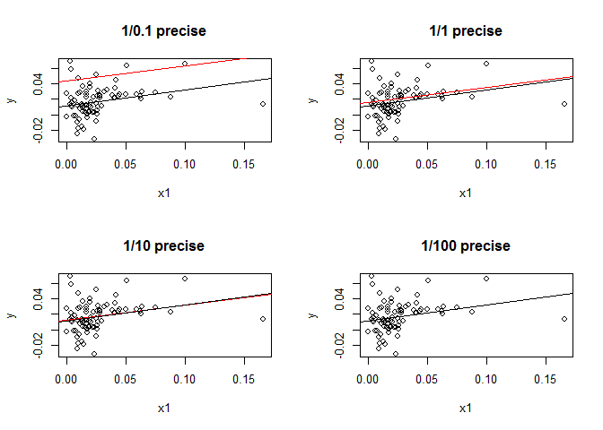
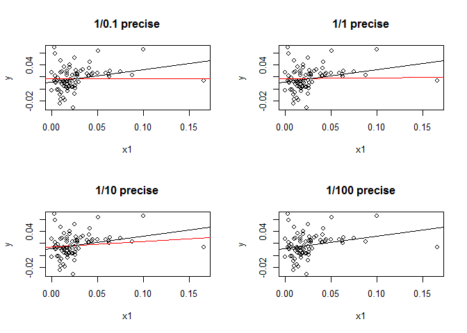

Programming Practices in Exercise 2
================
Yilin He

### The conjugate Gaussian linear model (Part 2 - D)

Given the priors for *β* and *ω* and likelihood *p*(**y**|*ω*, *β*), we can derive the marginal posterior *p*(*β*|**y**) as a *t* distribution with location **m**<sub>\*</sub> = *Λ*<sub>\*</sub><sup>−1</sup>(*X*′*Λ***y** + *K***m**), where *Λ*<sub>\*</sub> = *X*′⋅*Λ* ⋅ *X* + *K*.

So the key idea for bayesian linear model solution is to find *β* such that the marginal posterior *p*(*β*|**y**) is optimized, so we make estimated linear model coefficients equal to **m**<sub>\*</sub>

``` r
library(readr)

# read_csv() is a more efficient alternative CSV solver 
# compared with R base function read.csv().
gdpgrowth = read_csv("E:/R/gdpgrowth.csv")

y = gdpgrowth$GR6096; n = length(y)

x0 = rep(1., n); x1 = gdpgrowth$DEF60

# X is the design matrix for OLS linear model y = beta.1 x + beta.0 + e
# run "head()" command to take a look of X
X = matrix(c(x0, x1), ncol = 2, byrow = FALSE)

# set up prior parameters: Lambda, K, m
L = diag(n); m = c(0.3,0.2)
# make prior precision matrix something diagonal and vague
vague_params = c(.1, 1, 10, 100)

par(mfrow=c(2,2))
for (vague_param in vague_params) {
  K = diag(2)/vague_param

  L.star = t(X) %*% L %*% X + K
  m.star = solve(L.star) %*% (t(X) %*% L %*% y + K %*% m)

  m.star
  coef(lm(y~x1))
  
  plot(x1, y, main = paste0("1/",vague_param," precise"))
  abline(m.star, col = "red")
  abline(lm(y~x1))
}
```



``` r
par(mfrow=c(1,1))
```

From the above graphs, we can see that running MAP with a faint precision matrix in the model coefficients' prior will give an approximate OLS estimate for *β* (The red and black regression lines finally 100% overlapped). **So choices for 's prior really make a difference to the estimates**

### The conjugate Gaussian linear model (Part 3 - C)

``` r
library(readr)
library(coda)
library(MASS)

# same as last example
gdpgrowth = read_csv("E:/R/gdpgrowth.csv")
y = gdpgrowth$GR6096; n = length(y)
x0 = rep(1., n); x1 = gdpgrowth$DEF60
X = matrix(c(x0, x1), ncol = 2, byrow = FALSE)

# parameter setup
# 1. lambda_i ~ Gamma(h/2, h/2)
h = 1
# 2. p: number of coefficients
p = 2
# 3. w ~ Gamma(d/2, eta/2), 
# for heavy tail error, make d big while eta small
d = .1; eta = 1
# 4. beta|w ~ N(m, inv(wK))
m = c(0,0); vague_params = c(.1, 1, 10, 100)

# integrated parameters
# 1. Sy = y' Lam.mat y
SY = function(L){
  return(t(y)%*%L%*%y)
}
# 2. L.star = X' L X + K
Lstar = function(L){
  L.star = t(X) %*% L %*% X + K
  return(L.star)
}
# 3. m.star = inv(L.star) (X' L y + K m)
mstar = function(L){
  L.star = Lstar(L)
  m.star = solve(L.star) %*% (t(X) %*% L %*% y + K %*% m)
  return(m.star)
}


par(mfrow=c(2,2))
for (vague_param in vague_params) {
  
  K = diag(2)/vague_param
  
  # initialize L 
  L.vec = rgamma(n, shape = h/2, rate = h/2)
  L = diag(L.vec)
  
  Beta = c()
  
  # start sampling
  
  for (iter in 1:1000) {
    
    # update integrated parameters
    Sy = SY(L)
    L.star = Lstar(L)
    m.star = mstar(L)
    
    # sample new w
    m.A = (d+n) / 2 + p
    m.B = 0.5 * (
      Sy + eta + t(m) %*% K %*% m - 
        t(t(X) %*% L %*% y + K %*% m) %*% m.star
    )
    w = rgamma(1, shape = m.A, rate = m.B)
    
    # sample beta
    beta.mu = m.star
    beta.cov = solve(L.star) / w
    bt = mvrnorm(1, beta.mu, beta.cov)
    
    # record beta
    Beta = cbind(Beta, bt)
    
    # sample L
    L.A = (h + 1) / 2
    L.B = h / 2 + 0.5 * w * (y - X %*% bt)^2 
    L.vec = rgamma(n, shape = L.A, rate = L.B)
    L = diag(L.vec)
  }
  
  Beta.burn = Beta[,501:1000]
  coefs = apply(Beta.burn, 1, mean)
  print(coefs)
  
  plot(x1, y, main = paste0("1/",vague_param," precise"))
  abline(coefs, col = "red")
  abline(lm(y~x1))
}
```

    ## [1] 0.0164073077 0.0001136728

    ## [1] 0.01656291 0.01371544

    ## [1] 0.01404422 0.08978357

    ## [1] 0.01142829 0.20614037


