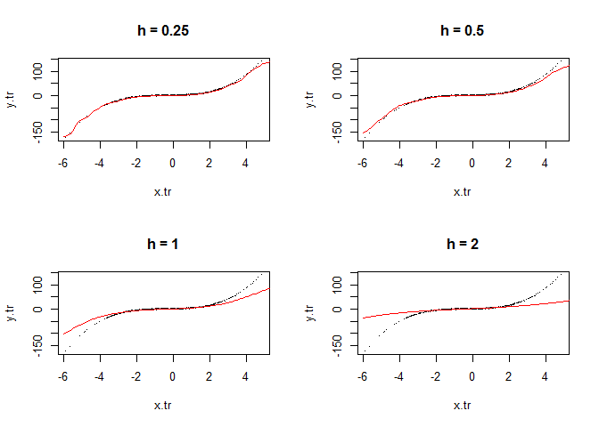
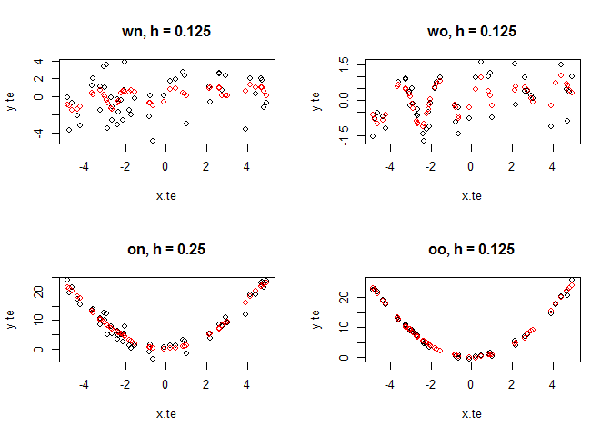
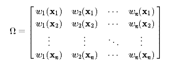
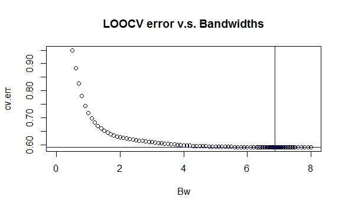

Programming Practices in Exercise 3
================
Yilin He

### Curve fitting by linear smoothing -- part (B)

Basic setup:

1.  *x*'s are sampled from 𝒩(0, 4); *f*(*x*)=*x*<sup>3</sup> + *x*<sup>2</sup> + *x*.
2.  Error *ε* is sampled from 𝒩(0, 1).
3.  Bandwidth: try *h* = .25, .5, 1, 2.

Black dots are the training data, red curves are fitted values.

``` r
# Bandwidth: h = .25, .5, 1, 2
Bw = c(.25, .5, 1, 2)

# ground truth
f = function(x){
  return(x^3 + x^2 + x)
}

# prepare dataset
N = 500
x.tr = rnorm(N, mean = 0, sd = 2)
x.tr = x.tr - mean(x.tr)
e = rnorm(N, mean = 0, sd = 1)
y.tr = f(x.tr) + e

x.fit = seq(-6, 6, .1)

par(mfrow=c(2,2))
for (h in Bw) {
  
  # compute weights; weights are stored in matrix W
  # W[i,j] = K((x.fit[i] - x.tr[j])/h) / norm_const
  W = matrix(rep(x.tr, length(x.fit)), nrow = length(x.fit), byrow = TRUE)
  W = exp( - 0.5 * ((W - x.fit) / h) ^ 2 )
  W = W / apply(W, 1, sum)
  
  # compute integrated y's
  y.fit = W %*% y.tr
  
  plot(x.tr, y.tr, pch = ".", main = paste0("h = ", h))
  lines(x.fit, y.fit, col="red")
  
}
```



``` r
par(mfrow=c(1,1))
```

### cross validation -- part (A) & (B)

*(A)* Use out-of-sample-validation to choose an optimal bandwidth.

500 samples, training set takes 90%. Test for optimal bandwidth within *h* = .125, .25, .5, .75, 1, 2, 4.

``` r
# Bandwidth: h = .125, .25, .5, .75, 1, 2, 4
Bw = c(.125, .25, .5, .75, 1, 2, 4)

# ground truth
f = function(x){
  return(x^3 + x^2 + x)
}

# prepare training & testing dataset
N = 500
x = rnorm(N, mean = 0, sd = 2)
x = x - mean(x)
e = rnorm(N, mean = 0, sd = 1)
y = f(x) + e

# training-testing split
tst.idx = (as.integer(0.9 * N) + 1) : N
x.te = x[tst.idx]; y.te = y[tst.idx]
x.tr = x[-tst.idx]; y.tr = y[-tst.idx]

err = c()

for (h in Bw) {
  
  # compute weights; weights are stored in matrix W
  # W[i,j] = K((x.fit[i] - x.tr[j])/h) / norm_const
  W = matrix(rep(x.tr, length(x.te)), nrow = length(x.te), byrow = TRUE)
  W = exp( - 0.5 * ((W - x.te) / h) ^ 2 )
  W = W / apply(W, 1, sum)
  
  # compute integrated y's
  y.eval = W %*% y.tr
  
  # record squared error
  error = sum((y.te - y.eval)^2)
  err = c(err, error)
  
  cat("squared error for h = ", h, ": ", round(error, digits = 2), "\n")
}
```

    ## squared error for h =  0.125 :  62.06 
    ## squared error for h =  0.25 :  128.68 
    ## squared error for h =  0.5 :  299.95 
    ## squared error for h =  0.75 :  1237.44 
    ## squared error for h =  1 :  3139.19 
    ## squared error for h =  2 :  11416.42 
    ## squared error for h =  4 :  17942.89

``` r
h.optimal = Bw[which.min(err)]
h.optimal
```

    ## [1] 0.125

*(B)* Based on (A), see the optimal bandwidth for

1.  wiggly & noisy;
2.  wiggly & not noisy;
3.  smooth & noisy;
4.  smooth & not noisy.

Basic setup:

1.  wiggly: *y* = sin(*π* ⋅ *x*)+*ε*;
2.  smooth: *y* = *x*<sup>2</sup> + *ε*;
3.  noisy: *ε* ∼ 𝒩(0, 4);
4.  not noisy: *ε* ∼ 𝒩(0, .25)
5.  try bandwidth *h* = .125, .25, .5, .75, 1, 2, 4

``` r
# Bandwidth: h = .125, .25, .5, .75, 1, 2, 4
Bw = c(.125, .25, .5, .75, 1, 2, 4)

# prepare dataset
N = 500
x = runif(N, -5, 5)
tst.idx = (as.integer(0.9 * N) + 1) : N
x.tr = x[-tst.idx]; x.te=x[tst.idx]

# group code:
# double-character, first for wiggle (or not), second for noisy (or not)
# "w" for wiggle, "n" for noisy, "o" for not
resp.w = sin(pi*x); resp.o = x^2; e.n = rnorm(N, sd=2); e.o = rnorm(N, sd = .5)

y.wn = resp.w + e.n; y.wo = resp.w + e.o; y.on = resp.o + e.n; y.oo = resp.o + e.o


h_solver = function(x.tr, y.tr, x.te, y.te, grp="wn"){
  # the h_solver function estimates the best option for bandwidth 
  # (from given proposals) by picking out the h that gives the optimal
  # performance in the test set
  
  # these vectors will record test error and estimated y's respectively
  err = c()
  Y.eval = c()
  
  for (h in Bw) {
    
    # compute weights; weights are stored in matrix W
    # W[i,j] = K((x.fit[i] - x.tr[j])/h) / norm_const
    W = matrix(rep(x.tr, length(x.te)), nrow = length(x.te), byrow = TRUE)
    W = exp( - 0.5 * ((W - x.te) / h) ^ 2 )
    W = W / apply(W, 1, sum)
    
    # compute & record integrated y's
    y.eval = W %*% y.tr
    Y.eval = cbind(Y.eval, y.eval)
    
    # record squared error
    error = sum((y.te - y.eval)^2)
    err = c(err, error)
    
  }
  
  h.optimal = Bw[which.min(err)]
  y.eval = Y.eval[,which.min(err)]
  
  plot(x.te, y.te, main = paste0(grp, ", h = ", h.optimal))
  points(x.te, y.eval, col = "red")
  
}

par(mfrow = c(2,2))

# optimal h for "w&n"
y.wn.tr = y.wn[-tst.idx]; y.wn.te = y.wn[tst.idx]
h_solver(x.tr, y.wn.tr, x.te, y.wn.te)

# optimal h for "w&o"
y.wo.tr = y.wo[-tst.idx]; y.wo.te = y.wo[tst.idx]
h_solver(x.tr, y.wo.tr, x.te, y.wo.te, grp = "wo")

# optimal h for "o&n"
y.on.tr = y.on[-tst.idx]; y.on.te = y.on[tst.idx]
h_solver(x.tr, y.on.tr, x.te, y.on.te, grp = "on")

# optimal h for "o&o"
y.oo.tr = y.oo[-tst.idx]; y.oo.te = y.oo[tst.idx]
h_solver(x.tr, y.oo.tr, x.te, y.oo.te, grp = "oo")
```



``` r
par(mfrow=c(1,1))
```

### Local polynomial regression -- part (E) & (F)

*(E)* & *(F)* The problem requires us to choose the best bandwidth *h* (from a set of proposals) of local linear estimator using LOOCV. By what we already know about local linear estimator and leave-one-out cross validation, we need 4 steps to make that happen:

1.  calculating the weight matrix *Ω* such that




2.  normalize *Ω* by row (get the Hat Matrix *H*),
3.  calculate LOOCV,
4.  find the bandwidth *h* that gives minimal LOOCV error.

```r
library(readr)

# prepare dataset
utilities = read_csv("E:/R/utilities.csv")
data.x = utilities$temp; data.y = utilities$gasbill / utilities$billingdays


s.func = function(x, j, h){
  
  # This function computes s_j(x) defined in 
  # ex03-local polynomial regression - part(B)
  
  d = (data.x - x) / h
  ker = dnorm(d, 0, 1)
  s.j = ker %*% (data.x - x)^j
  
  return(s.j)
}


w.func = function(x, h){
  
  # 1. This function computes w(x) = [w1(x), w2(x), ..., wn(x)]
  # 2. wi(x), i = 1,2,...,n is defined in 
  #    ex03-local polynomial regression - part(B)
  
  d = (data.x - x) / h
  ker = dnorm(d, 0, 1)
  s.part = s.func(x, 2, h) - (data.x - x) * s.func(x, 1, h)
  
  # compute weights
  w.x = ker * s.part
  
  # normalize weights
  w.x = w.x / sum(w.x)
  
  return(w.x)
}


Hat.func = function(bw){
  
  H.T = sapply(data.x, function(x) w.func(x, h=bw))
  H = t(H.T)
  
  return(H)
}


LOOCV = function(bw){
  
  # 1. This function calculates the LOOCV error for local linear estimator
  #    on the dataset(data.x, data.y) 
  # 2. Uses a gaussian kernel with bandwidth bw.
  
  # Compute the diagonal elements of Hat matrix H.
  H = Hat.func(bw)
  dH = H[row(H) == col(H)]
  
  check.value = sum(dH)
  
  # computes y.hat
  y.hat = H %*% data.y
  
  # computes LOOCV by the equation in
  # ex03 - cross validation - part (C)
  loocv = sum( ((data.y - y.hat)/(1 - dH))^2 )
  
  results = list(
    "loocv" = loocv / length(data.y),
    "ckval" = check.value
  )
  
  return(results)
}


bw_select = function(Bw){
  
  # Select optimal bw from proposed Bw
  # in terms of minimum loocv error.
  
  cv.err = c()
  for (bw in Bw) {
    loocv_err = LOOCV(bw)$loocv
    cv.err = c(cv.err, loocv_err)
  }
  
  h.o.idx = which.min(cv.err)
  h.optimal = Bw[h.o.idx]
  
  results = list(
    "h.o.idx" = h.o.idx,
    "h.optimal" = h.optimal,
    "err" = cv.err
  )
  
  return(results)
}


bw_solver = function(bw.lb, bw.ub, precision){
  
  # binary search for optimal bandwidth within [bw.lb, bw.ub],
  # with precision no lower than the specified "precision".
  
  curr.prec = .1
  curr.lb = bw.lb; curr.ub = bw.ub
  
  Bw = cv.err = c()
  
  repeat{
    
    curr.Bw = seq(curr.lb, curr.ub, curr.prec)
    N = length(curr.Bw)
    
    # collect results from bandwidth selection
    results = bw_select(curr.Bw)
    h.idx = results$h.o.idx; h.value = results$h.optimal
    cverr = results$err; min.err = min(cverr)
    
    # narrow down the searching scope
    radius = min(h.idx, N - h.idx + 1)
    radius = as.integer(radius / 2)
    ub.idx = h.idx + radius; lb.idx = h.idx - radius
    
    # record display values (for now)
    Bw = c(Bw, curr.Bw[- (lb.idx:ub.idx)])
    cv.err = c(cv.err, cverr[-(lb.idx:ub.idx)])
    
    # adjust searching scope
    curr.lb = curr.Bw[lb.idx]; curr.ub = curr.Bw[ub.idx]
    curr.prec = curr.prec / 2
    
    if((curr.lb <= precision) || (radius == 0)){
      
      Bw = c(Bw, curr.Bw[(lb.idx:ub.idx)])
      cv.err = c(cv.err, cverr[(lb.idx:ub.idx)])
      
      break
    }
  }
  
  plot(Bw, cv.err, main = "LOOCV error v.s. Bandwidths")
  abline(h = min.err, col = "blue"); abline(v = h.value, col = "blue")
  
  return(h.value)
  
}

bw = bw_solver(0, 8, .01)
```



The optimal bandwidth turned out to be around 6.87.

```r
y.hat = Hat.func(bw) %*% data.y
resid = data.y - y.hat

plot(data.x, resid, main = "residual plot")
```


The residual looks not totally independent with the explanatory variable.


