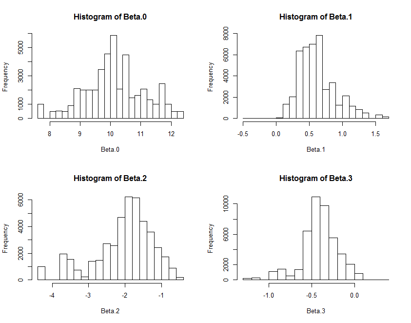

## Cheese-elastic Case

### Part I: data preparation
Package requirment:

```r
library(lme4)
library(tidyverse)
library(lattice)
library(readr)

rm(list=ls())
```

To start with, I fit a Bayesian linear model as well as several MLR models through OLS. I expect the Bayesian performs at least among the top 30% of the models fitted in the frequentist fashion. So I split the cheese data set into a bigger training half and a smaller evaluation half. By inspecting the data size for each store, I fix the training sample size for each store at 50. Namely, I gather the first 50 data for each store to form the training set, and what remain make up the eval set.

```r

cheese = read_csv("E:/R/cheese.csv")

cheese$store = factor(cheese$store)
cheese = cheese[order(cheese$store),]

# collect the number of data point for each store
N = as.numeric(summary(cheese$store))
n = length(N)


# Gather the first 50 data in each store to form the training set
# by specifying starting points for each store 
# and count 49 samples afterwards for each starting point.
edpt = cumsum(N)
stpt = c(1,(edpt+1)[-n])

m = 50
tr_idx = c(matrix(rep(stpt, times = m), nrow = m, byrow = TRUE) + (0:(m-1)))


# Split dataset into training set and eval set for OLS model.
# We're about to train the model on the training set and evaluate its performance on the eval set.
# Specifically, we're going to compare the performace of the model fitted via gibbs sampling and 
# the ones by solving OLS. 
cheese.tr = cheese[tr_idx,]
cheese.ev = cheese[-tr_idx,]


# Prepare training & eval data for bayesian model.
# Collecting training data is just a walk in the park...
y = log(cheese.tr$vol); x = log(cheese.tr$price); D = cheese.tr$disp
y = matrix(y, nrow = n, byrow = TRUE)
x = matrix(x, nrow = n, byrow = TRUE)
D = matrix(D, nrow = n, byrow = TRUE)

```

Since "rectangulating" y's, x's and D's in the evaluation set into matrices makes life a lot easier, I append 0's to the short rows to make them as long as the longest.  Basically this is what I intend to do next for the eval set:

```r
# data11, data12, data13, data14, data15, 0
# data21, data22, 0,      0,      0,      0
# data32, data32, data33, 0,      0,      0
# data41, data42, data43, data44, data45, data46
# data51, data52, data53, data54, 0,      0
```
```r

# While it's a bit difficult to "rectangulate" the test data
N_te = as.numeric(summary(cheese.ev$store))
maxsize = max(N_te)
y_te = x_te = D_te = mask_te = rep(0, maxsize * n)

# "inc" is the current (starting index -1) of each store's eval data
inc = c(0, cumsum(N_te)[-n])
# "stpt_te" is the ideal (starting index -1) of each store's eval data
stpt_te = maxsize * c(0:(n-1))
# So we have the store level shift in index
shifts = stpt_te - inc
# From there we can get sample level shift in index
idx.sft = unlist(lapply(c(1:n), function(k) cbind(rep(shifts[k], times = N_te[k])))) 

critic_idx = c(1:length(idx.sft)) + idx.sft

y_te[critic_idx] = log(cheese.ev$vol)
x_te[critic_idx] = log(cheese.ev$price)
D_te[critic_idx] = cheese.ev$disp
mask_te[critic_idx] = rep(1, length(critic_idx))

y_te = matrix(y_te, nrow = n, byrow = TRUE)
x_te = matrix(x_te, nrow = n, byrow = TRUE)
D_te = matrix(D_te, nrow = n, byrow = TRUE)
mask_te = matrix(mask_te, nrow = n, byrow = TRUE)

```

### Part II: fit the Bayesian linear model

```r

# Obtain initial value of beta.0i, beta.1i, beta.2i and beta.3i
# Meanwhile, estimate (mu0, v0^2), (mu1, v1^2), (mu2, v2^2) and (mu3, v3^2)

hlm3 = lmer(log(vol) ~ (1 + log(price) + disp + log(price):disp | store), data=cheese.tr)

# summary(hlm3)
# coef(hlm3)

# Extract the coefficients
beta.hat = coef(hlm3)$store[,c(4,2,1,3)]
beta.hat = as.matrix(beta.hat)
mu = colMeans(beta.hat)
sd = apply(beta.hat, 2, sd)


# Initialize parameters
beta.0 = beta.hat[,1]
beta.1 = beta.hat[,2]
beta.2 = beta.hat[,3]
beta.3 = beta.hat[,4]
lambda = 1

Beta.0 = Beta.1 = Beta.2 = Beta.3 = Lambda = c()


# Running the Markov chain for Ite times
Ite = 5000
st = Ite - 499; ed = Ite
SqErr = c()

for (iter in 1:Ite) {
  
  # Sample beta.0 from its full conditional then record.
  # 'mker' stands for "mean kernel", meaning the most convoluted part in computing mean.
  r0 = 1 / (1/(sd[1]^2) + m * lambda)
  mker0 = y - beta.1 * D - beta.2 * x - beta.3 * D * x
  phi0 = r0 * (
    lambda * apply(mker0, 1, sum) + mu[1] / (sd[1]^2)
  )
  beta.0 = rnorm(n, phi0, r0)
  Beta.0 = cbind(Beta.0, beta.0)
  
  
  # Sample beta.1 from its full cond. then record.
  r1 = 1 / (1/(sd[2]^2) + lambda * apply(D, 1, sum))
  mker1 = D * (y - beta.0 - (beta.2 + beta.3) * x)
  phi1 = r1 * (
    lambda * apply(mker1, 1, sum) + mu[2] / (sd[2]^2)
  )
  beta.1 = rnorm(n, phi1, r1)
  Beta.1 = cbind(Beta.1, beta.1)
  
  
  # Sample beta.2 from its full cond. then record.
  r2 = 1 / (1/(sd[3]^2) + lambda * apply(x^2, 1, sum))
  mker2 = x * (y - beta.0 - beta.1 * D - beta.3 * D * x)
  phi2 = r2 * (
    lambda * apply(mker2, 1, sum) + mu[3] / (sd[3]^2)
  )
  beta.2 = rnorm(n, phi2, r2)
  Beta.2 = cbind(Beta.2, beta.2)
  
  
  # Sample beta.3 from its full cond. then record.
  r3 = 1 / (1/(sd[4]^2) + lambda * apply(D * x^2, 1, sum))
  mker3 = D * x * (y - beta.0 - beta.1 - beta.2 * x)
  phi3 = r3 * (
    lambda * apply(mker3, 1, sum) + mu[4] / (sd[4]^2)
  )
  beta.3 = rnorm(n, phi3, r3)
  Beta.3 = cbind(Beta.3, beta.3)
  
  
  # Sample lambda from its full cond. then record.
  lbd.a = (m * n + 1) / 2
  lbd.b = 0.5 * sum((y - beta.0 - beta.1 * D - beta.2 * x - beta.3 * D * x)^2) + 0.5 
  lambda = rgamma(1, lbd.a, lbd.b)
  Lambda = c(Lambda, lambda)
  
  if(iter >= st){
    y_ev = beta.0 + beta.1 * D_te + beta.2 * x_te + beta.3 * D_te * x_te
    sqer = sum((y_te - y_ev)^2 * mask_te)
    SqErr = c(SqErr, sqer)
  }
  
}


# Collect burnt-in samples.

Beta.0 = Beta.0[,st:ed]
Beta.1 = Beta.1[,st:ed]
Beta.2 = Beta.2[,st:ed]
Beta.3 = Beta.3[,st:ed]

par(mfrow=c(2,2))
hist(Beta.0); hist(Beta.1); hist(Beta.2); hist(Beta.3)
par(mfrow = c(1,1))

```

