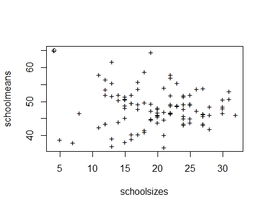
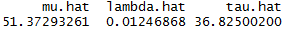

## Math Tests

#### Part I

This part is all about examining the phenomenon that the extreme school-level averages tend to be at schools where fewer students were sampled. To visualize such a phenomenon, I plot "school_mean" against "school_size" and circled the most extreme "school_mean", it's true that the maximum of shool level mean score is found at the school that only has a sample size less than 5. I guess what behind the relationship between small sample size and extreme sample mean is that the sample variance is too large, so the likelihood of some crazy observations won't diminish.


```r
# mathtest problem
suppressMessages('mosaic')
library(readr)
library(mosaic)

datapath = 'E:/R/mathtest.csv'
mathtest = read_csv(datapath)
# order the data by school
mathtest = mathtest[order(mathtest$school),]

# collect schools & number of schools (denoter by n)
sch = unique(mathtest$school)
n = length(sch)

# Ensure that school is treated as a categorical variable.
# This has been automatically done when load the dataset with 'read_csv' command.
mathtest$school = factor(mathtest$school)

# This won't work without mosaic loaded
schoolmeans = mean(mathscore~school, data=mathtest)
schoolsizes = as.numeric(summary(mathtest$school))

# take the extreme point
maxmean = max(schoolmeans)
maxmean.size = schoolsizes[which.max(schoolmeans)]

# problem 1 -- Notice the extremes tend to be for schools with low sample sizes
plot(schoolsizes, schoolmeans, pch="+")
points(maxmean.size, maxmean)

```


#### Part I

In this part I use Gibbs sampling to obtain the estimated parameters in the hierarchical mdoel. The math for establishing gibbs samplers is elaborated [here](math/mathtest_gibbs_elaboration.PDF). Let's first define the samplers as below.

```r
# Problem 2 -- fit the hierarchical model via gibbs sampling.

# Collect important info from dataset.
# (This won't work without mosaic loaded)
# 1. yi.bar: the mean value for each school's math scores.
# 2. ni: the sample size of each school.
# 3. N: the size of entire dataset.
# 4. Syi: the school level math test score standard deviations.
# 5. y.bar: the mean value for all schools' math scores.
yi.bar = mean(mathscore~school, data=mathtest)
ni = as.numeric(summary(mathtest$school))
N = sum(ni)
Syi = sd(mathscore~school, data=mathtest)
y.bar = mean(mathtest$mathscore)


# Define the samplers
# 1. The sampler for mu: mu_splr(lambda, eta, phi)
#    args: lambda := 1 / (sigma^2);
#          eta: the parameter introduced for redundant reparameterization;
#          phi: [phi[1], phi[2], ..., phi[n]]

mu_splr = function(lambda, eta, phi){
  
  # f(mu| ... ) is a normal dist. with mean mu.m and var mu.v
  
  mu.v = 1 / (lambda * N)
  
  sig = lambda ^ (-0.5)
  phi.bar = sum(ni * phi) / N
  mu.m = y.bar - eta * sig * phi.bar
  
  new.samp = rnorm(1, mu.m, mu.v ^ (0.5))
  
  return(new.samp)
  
}


# 2. The sampler for eta: eta_splr(phi, lambda, mu)

eta_splr = function(phi, lambda, mu){
  
  # f(eta| ... ) is a normal dist. with mean eta.m and var eta.v
  
  eta.v = 1 / (1 + sum(ni * phi^2))
  eta.m = eta.v * sum(ni * phi * (yi.bar - mu)) * lambda ^ (-0.5)
  
  new.samp = rnorm(1, eta.m, eta.v ^ (0.5))
  
  return(new.samp)
  
} 


# 3. The sampler for phi: phi_splr(eta, xi, lambda, mu)
#    args: xi := 1 / (g ^ 2).

phi_splr = function(eta, xi, lambda, mu){
  
  # f(phi[i]| ... ) is a normal dist. with mean phi.m[i] and var phi.v[i]
  
  phi.v = 1 / (ni * eta^2 + xi)
  phi.m = phi.v * ni * eta * lambda^(0.5) * (yi.bar - mu)
  
  new.samp = rnorm(n, phi.m, phi.v ^ (0.5))
  
  return(new.samp)
  
}


# 4. The sampler for xi: xi_splr(phi)

xi_splr = function(phi){
  
  # f(xi| ... ) is a Gamma dist. with shape xi.a and rate xi.b
  
  xi.a = (1 + n) / 2
  xi.b = 0.5 + sum(phi^2) / 2
  
  new.samp = rgamma(1, xi.a, xi.b)
  
  return(new.samp)
  
}


# 5. The sampler for lambda: lbd_splr(eta, phi, lambda, mu, xi)

lbd_splr = function(eta, phi, lambda, mu, xi){
  
  # f(lambda| ... ) is a Gamma dist. with shape lbd.a and rate lbd.b
  
  lbd.a = (N + n + 2) / 2
  
  sig = lambda ^ (-0.5)
  g = xi ^ (-0.5)
  
  theta = mu + eta * sig * phi
  tau = abs(eta) * g
  
  lbd.b = 0.5 * sum((ni-1)*Syi^2 + ni*(yi.bar - theta)^2) + sum((theta - mu)^2) / (2 * tau^2)
  
  new_samp = rgamma(1, lbd.a, lbd.b)
  
  return(new_samp)
  
}
```

Next, run the markov chain to obtain parameters from their full conditionals.

```r
# Initialize parameters
mu = mean(mathtest$mathscore)
eta = 0
phi = rep(0,n)
xi = lambda = 1

Mu = Eta = Xi = Lambda = c()
Phi = c()

Ite = 5000
# Running the chain for Ite times

for (iter in 1:Ite) {
  
  # Sample mu from f(mu| ... ) then record.
  mu = mu_splr(lambda, eta, phi)
  Mu = c(Mu, mu)
  
  # Sample eta from f(eta| ... ) then record.
  eta = eta_splr(phi, lambda, mu)
  Eta = c(Eta, eta)
  
  # Sample phi from f(phi| ... ) then record.
  phi = phi_splr(eta, xi, lambda, mu)
  Phi = cbind(Phi, phi)
  
  # Sample xi from f(xi| ... ) then record.
  xi = xi_splr(phi)
  Xi = c(Xi, xi)
  
  # Sample lambda from f(lambda| ... ) then record.
  lambda = lbd_splr(eta, phi, lambda, mu, xi)
  Lambda = c(Lambda, lambda)
  
}
```

Samples used for parameter estimation will be collected after burnt-in.

```r
# Extract burnt-in samples
st = Ite - 1000 + 1; ed = Ite

Mu = Mu[st:ed]; Eta = Eta[st:ed]; Phi = Phi[, st:ed]
Xi = Xi[st:ed]; Lambda = Lambda[st:ed]

# par(mfrow = c(2,2))
# plot(Mu, type = "l"); plot(Eta, type = "l")
# plot(Xi, type = "l"); plot(Lambda, type = "l")
# par(mfrow = c(1,1))

# Finally, obtain the estimated parameters of the hierarchical model.
Theta = Mu + Eta * Lambda^(-0.5) * t(Phi)
theta.hat = apply(Theta, 2, mean)
mu.hat = mean(Mu)
lbd.hat = mean(Lambda)
Tau = abs(Eta) * Xi^(-0.5)
tau.hat = mean(Tau)

params = c(mu.hat, lbd.hat, tau.hat)
names(params) = c("mu.hat", "lambda.hat", "tau.hat")

params

```


