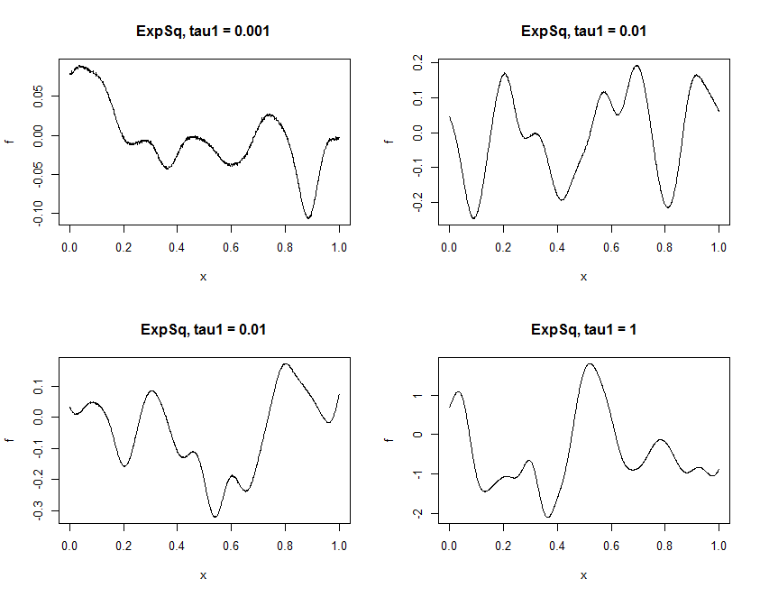
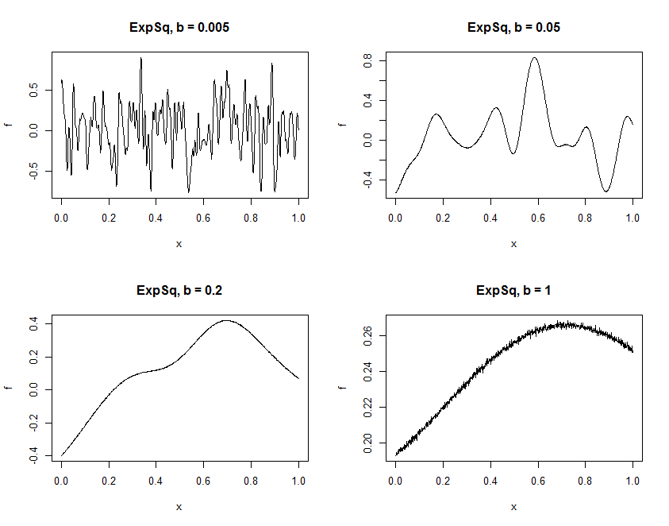
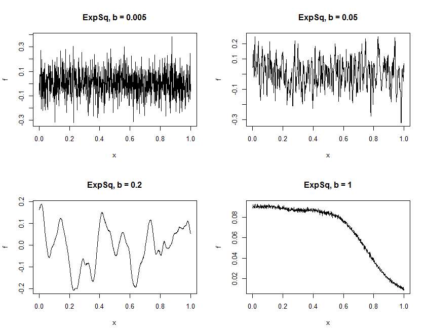

### Gaussian Process
#### To do:

  1. Simulate mean-zero Gaussian Processes on [0,1] under covariance function defined by  
    
  and inteprete the role each hyperparameter played.  
  
  2. See what happens if tau_2 squared equals zero.  
  
  3. Replace covariance function with  
    
  and repeat steps in 1.
  
  ```r
  
  library(MASS)
library(Rcpp)

# Define covariance matrices

# Squared Exponential
# Inputs
# kappa: (range b, variance, nugget)
#		a set of covariance parameters for the squared exponential covariance function
# x: n1-vector of 1D spatial locations
# y: n2-vector of 1D spatial locations
#
# Returns
# C, a matrix of dimension (n1 x n2)
# C(i,j) is the covariance between f(x1[i]) and f(x2[j])
# where f is a Gaussian process parametrized by kappa
cppFunction('
            NumericMatrix CSE(NumericVector x, NumericVector y, NumericVector kappa) {
            double arg, distance2;
            int n1 = x.size();
            int n2 = y.size();
            NumericMatrix C(n1,n2);
            for(int i = 0; i < n1; i++) {
            for(int j=0; j < n2; j++) {
            arg = (x[i] - y[j])/kappa[0];
            distance2 = arg*arg;
            C(i,j) = kappa[1]*exp(-0.5*distance2);
            if(arg == 0.0) C(i,j) += kappa[2];
            }
            }
            return C;
            }
            ')

n = 1000
x = seq(0, 1, length.out = n)

# start from kappa[2] = 1e-6, kappa[1] = .1 and b = c(0.005, 0.05, 0.2, 1)
B = c(.005, .05, .2, 1)
mu = rep(0, times = n)

par(mfrow=c(2,2))
for (b in B) {
  
  # define hyperparameters
  kappa = c(b, .1, 1e-6)
  
  # compute covariance matrix
  C = CSE(x, x, kappa)
  
  # sample (simulate) Gaussian Process
  f = mvrnorm(1, mu, C)
  
  plot(x, f, type = "l", pch = ".", main = paste0("ExpSq, b = ", b))
    
}
  
```


 
It seems that a larger *b* will give a more smooth Gaussian Process. I guess the reason is that as *b* increases, the covariance between *f(x<sub>i</sub>)* and *f(x<sub>j</sub>)* grows as well, so images of *x*'s which are close to each other will not be faraway from each other. 

Next, let's see the effct of tau[1].  

```r
# start from kappa[2] = 1e-6, kappa[1] = c(.001, .01, .1, 1) and b = 0.05
T1 = c(.001, .01, .01, 1)
mu = rep(0, times = n)

par(mfrow=c(2,2))
for (t1 in T1) {
  
  # define hyperparameters
  kappa = c(.05, t1, 1e-6)
  
  # compute covariance matrix
  C = CSE(x, x, kappa)
  
  # sample (simulate) Gaussian Process
  f = mvrnorm(1, mu, C)
  
  plot(x, f, type = "l", pch = ".", main = paste0("ExpSq, tau1 = ", t1))
  
}

```


From the above results, tau[1] looks like controls the magnitude of variation in the Gaussian Process. When tau[1] is around 0, although covariance between *f(x)*'s are small, the variances of them are small as well, meaning that they do not usually move away from the mean, so the "magnitude" is small.

Finally, let's go back to the first experiment but set tau[2] = 0.

```r
# start from kappa[2] = 0, kappa[1] = .1 and b = c(0.005, 0.05, 0.2, 1)
B = c(.005, .05, .2, 1)
mu = rep(0, times = n)

par(mfrow=c(2,2))
for (b in B) {
  
  # define hyperparameters
  kappa = c(b, .1, 1e-6)
  
  # compute covariance matrix
  C = CSE(x, x, kappa)
  
  # sample (simulate) Gaussian Process
  f = mvrnorm(1, mu, C)
  
  plot(x, f, type = "l", pch = ".", main = paste0("ExpSq, b = ", b))
    
}

```


Seems the change in tau[2] makes the generated functions more smooth.  At last, let's compare the results of Matern(5/2) covariance function and Squared Exponential covariance. The hyperparameters are selected the same as the first experiment.

```r
library(MASS)
library(Rcpp)

# Define covariance matrices

# Matern(5/2)
# Inputs
# kappa: (range b, variance, nugget)
#		a set of covariance parameters for the squared exponential covariance function
# x: n1-vector of 1D spatial locations
# y: n2-vector of 1D spatial locations
#
# Returns
# C, a matrix of dimension (n1 x n2)
# C(i,j) is the covariance between f(x1[i]) and f(x2[j])
# where f is a Gaussian process parametrized by kappa
cppFunction('
            NumericMatrix CSE(NumericVector x, NumericVector y, NumericVector kappa) {
            double arg, d2, d, mag, ker;
            int n1 = x.size();
            int n2 = y.size();
            NumericMatrix C(n1,n2);
            for(int i = 0; i < n1; i++) {
            for(int j=0; j < n2; j++) {

            arg = (x[i] - y[j])/kappa[0];
            d2 = arg*arg; 
            d = pow(d2, 0.5);

            mag = pow(kappa[1], 2) * (1 + sqrt(5)*d/kappa[0] + 5*d2/(3*pow(kappa[0], 2)));
            ker = exp(-sqrt(5) * d / kappa[0]);
            
            C(i,j) = mag * ker;
            if(arg == 0.0) C(i,j) += kappa[2];
            }
            }
            return C;
            }
            ')

n = 1000
x = seq(0, 1, length.out = n)

# start from kappa[2] = 0, kappa[1] = .1 and b = c(0.005, 0.05, 0.2, 1)
B = c(.005, .05, .2, 1)
mu = rep(0, times = n)

par(mfrow=c(2,2))
for (b in B) {
  
  # define hyperparameters
  kappa = c(b, .1, 1e-6)
  
  # compute covariance matrix
  C = CSE(x, x, kappa)
  
  # sample (simulate) Gaussian Process
  f = mvrnorm(1, mu, C)
  
  plot(x, f, type = "l", pch = ".", main = paste0("ExpSq, b = ", b))
  
}
```



