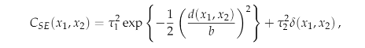
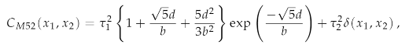

### Gaussian Process
#### To do:

  1. Simulate mean-zero Gaussian Processes on [0,1] under covariance function defined by  
    
  and inteprete the role each hyperparameter played.  
  
  2. See what happens if tau_2 squared equals zero.  
  
  3. Replace covariance function with  
  
