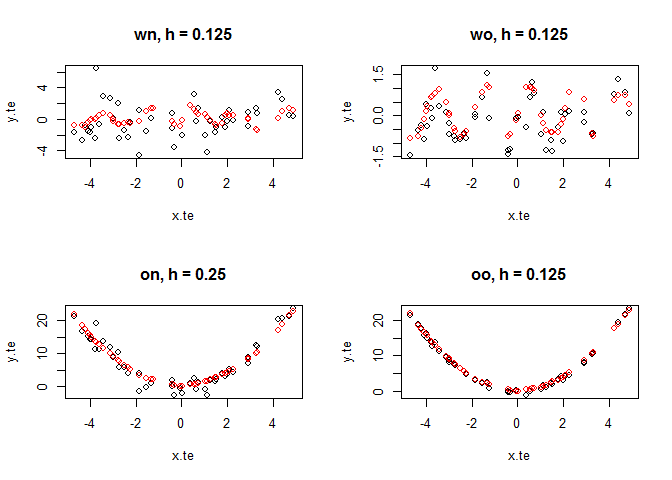

Programming Practices in Exercise 3
================
Yilin He

### Curve fitting by linear smoothing -- part (B)

Basic setup:

1.  *x*'s are sampled from 𝒩(0, 4); *f*(*x*)=*x*<sup>3</sup> + *x*<sup>2</sup> + *x*.
2.  Error *ε* is sampled from 𝒩(0, 1).
3.  Bandwidth: try *h* = .25, .5, 1, 2.

Black dots are the training data, red curves are fitted values.

``` r
# Bandwidth: h = .25, .5, 1, 2
Bw = c(.25, .5, 1, 2)

# ground truth
f = function(x){
  return(x^3 + x^2 + x)
}

# prepare dataset
N = 500
x.tr = rnorm(N, mean = 0, sd = 2)
x.tr = x.tr - mean(x.tr)
e = rnorm(N, mean = 0, sd = 1)
y.tr = f(x.tr) + e

x.fit = seq(-6, 6, .1)

par(mfrow=c(2,2))
for (h in Bw) {
  
  # compute weights; weights are stored in matrix W
  # W[i,j] = K((x.fit[i] - x.tr[j])/h) / norm_const
  W = matrix(rep(x.tr, length(x.fit)), nrow = length(x.fit), byrow = TRUE)
  W = exp( - 0.5 * ((W - x.fit) / h) ^ 2 )
  W = W / apply(W, 1, sum)
  
  # compute integrated y's
  y.fit = W %*% y.tr
  
  plot(x.tr, y.tr, pch = ".", main = paste0("h = ", h))
  lines(x.fit, y.fit, col="red")
  
}
```


``` r
par(mfrow=c(1,1))
```

### cross validation -- part (A) & (B)

*(A)* Use out-of-sample-validation to choose an optimal bandwidth.

500 samples, training set takes 90%. Test for optimal bandwidth within *h* = .125, .25, .5, .75, 1, 2, 4.

``` r
# Bandwidth: h = .125, .25, .5, .75, 1, 2, 4
Bw = c(.125, .25, .5, .75, 1, 2, 4)

# ground truth
f = function(x){
  return(x^3 + x^2 + x)
}

# prepare training & testing dataset
N = 500
x = rnorm(N, mean = 0, sd = 2)
x = x - mean(x)
e = rnorm(N, mean = 0, sd = 1)
y = f(x) + e

# training-testing split
tst.idx = (as.integer(0.9 * N) + 1) : N
x.te = x[tst.idx]; y.te = y[tst.idx]
x.tr = x[-tst.idx]; y.tr = y[-tst.idx]

err = c()

for (h in Bw) {
  
  # compute weights; weights are stored in matrix W
  # W[i,j] = K((x.fit[i] - x.tr[j])/h) / norm_const
  W = matrix(rep(x.tr, length(x.te)), nrow = length(x.te), byrow = TRUE)
  W = exp( - 0.5 * ((W - x.te) / h) ^ 2 )
  W = W / apply(W, 1, sum)
  
  # compute integrated y's
  y.eval = W %*% y.tr
  
  # record squared error
  error = sum((y.te - y.eval)^2)
  err = c(err, error)
  
  cat("squared error for h = ", h, ": ", round(error, digits = 2), "\n")
}
```

    ## squared error for h =  0.125 :  17296.98 
    ## squared error for h =  0.25 :  17350.43 
    ## squared error for h =  0.5 :  18240.42 
    ## squared error for h =  0.75 :  25171.07 
    ## squared error for h =  1 :  42128.74 
    ## squared error for h =  2 :  94896.93 
    ## squared error for h =  4 :  128215.2

``` r
h.optimal = Bw[which.min(err)]
h.optimal
```

    ## [1] 0.125

*(B)* Based on (A), see the optimal bandwidth for

1.  wiggly & noisy;
2.  wiggly & not noisy;
3.  smooth & noisy;
4.  smooth & not noisy.

Basic setup:

1.  wiggly: *y* = sin(*π* ⋅ *x*)+*ε*;
2.  smooth: *y* = *x*<sup>2</sup> + *ε*;
3.  noisy: *ε* ∼ 𝒩(0, 4);
4.  not noisy: *ε* ∼ 𝒩(0, .25)
5.  try bandwidth *h* = .125, .25, .5, .75, 1, 2, 4

``` r
# Bandwidth: h = .125, .25, .5, .75, 1, 2, 4
Bw = c(.125, .25, .5, .75, 1, 2, 4)

# prepare dataset
N = 500
x = runif(N, -5, 5)
tst.idx = (as.integer(0.9 * N) + 1) : N
x.tr = x[-tst.idx]; x.te=x[tst.idx]

# group code:
# double-character, first for wiggle (or not), second for noisy (or not)
# "w" for wiggle, "n" for noisy, "o" for not
resp.w = sin(pi*x); resp.o = x^2; e.n = rnorm(N, sd=2); e.o = rnorm(N, sd = .5)

y.wn = resp.w + e.n; y.wo = resp.w + e.o; y.on = resp.o + e.n; y.oo = resp.o + e.o


h_solver = function(x.tr, y.tr, x.te, y.te, grp="wn"){
  
  err = c()
  Y.eval = c()
  for (h in Bw) {
    
    # compute weights; weights are stored in matrix W
    # W[i,j] = K((x.fit[i] - x.tr[j])/h) / norm_const
    W = matrix(rep(x.tr, length(x.te)), nrow = length(x.te), byrow = TRUE)
    W = exp( - 0.5 * ((W - x.te) / h) ^ 2 )
    W = W / apply(W, 1, sum)
    
    # compute & record integrated y's
    y.eval = W %*% y.tr
    Y.eval = cbind(Y.eval, y.eval)
    
    # record squared error
    error = sum((y.te - y.eval)^2)
    err = c(err, error)
    
  }
  
  h.optimal = Bw[which.min(err)]
  y.eval = Y.eval[,which.min(err)]
  
  plot(x.te, y.te, main = paste0(grp, ", h = ", h.optimal))
  points(x.te, y.eval, col = "red")
  
}

par(mfrow = c(2,2))

# optimal h for "w&n"
y.wn.tr = y.wn[-tst.idx]; y.wn.te = y.wn[tst.idx]
h_solver(x.tr, y.wn.tr, x.te, y.wn.te)

# optimal h for "w&o"
y.wo.tr = y.wo[-tst.idx]; y.wo.te = y.wo[tst.idx]
h_solver(x.tr, y.wo.tr, x.te, y.wo.te, grp = "wo")

# optimal h for "o&n"
y.on.tr = y.on[-tst.idx]; y.on.te = y.on[tst.idx]
h_solver(x.tr, y.on.tr, x.te, y.on.te, grp = "on")

# optimal h for "o&o"
y.oo.tr = y.oo[-tst.idx]; y.oo.te = y.oo[tst.idx]
h_solver(x.tr, y.oo.tr, x.te, y.oo.te, grp = "oo")
```



``` r
par(mfrow=c(1,1))
```

